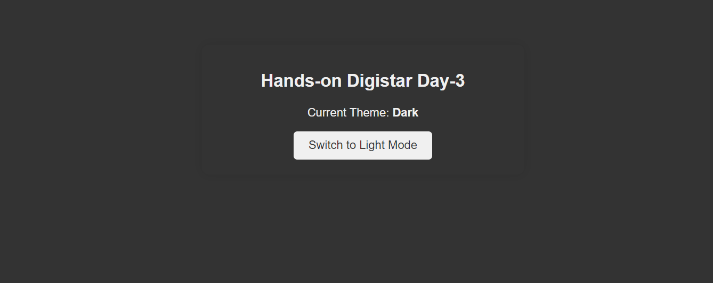
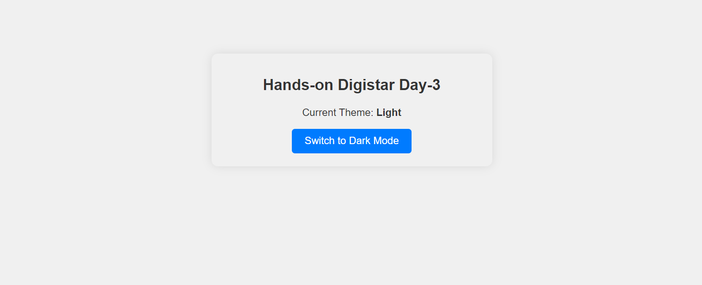

# Theme Switcher App

This is a simple React application that demonstrates the use of the Context API for global state management, specifically for toggling between light and dark themes. The application detects the user's preferred color scheme and allows manual toggling of the theme.

## Features

- **Automatic Theme Detection**: The app automatically sets the theme to light or dark based on the user's system preferences.
- **Manual Theme Switching**: Users can switch between light and dark themes using a toggle button.
- **Persistent Theme State**: The app maintains the current theme state throughout the session.

## Screenshots

### Dark Mode



### Light Mode



## Getting Started

These instructions will help you set up and run the project locally.

### Prerequisites

- **Node.js**: Ensure you have Node.js installed. You can download it from [here](https://nodejs.org/).
- **npm**: npm is installed with Node.js. You can verify its installation by running `npm -v` in your terminal.

### Installation

1. **Clone the repository:**

   ```bash
   git clone https://github.com/RizqiRahcman/ReactContext_Digistar2024.git
   cd ReactContext_Digistar2024
   ```

2. **Install the dependencies:**

   ```bash
   npm install
   ```

3. **Run the application:**

   ```bash
   npm start
   ```

4. **Open your browser and visit:**

   ```
   http://localhost:3000
   ```

## Project Structure

- **App.js**: The main entry point of the application. Wraps the `Component` inside the `ThemeProvider` to provide theme context.
- **components/Component.jsx**: A functional component that consumes the theme context and provides a UI for theme switching.
- **context/ThemeContext.jsx**: Contains the `ThemeProvider` and `ThemeContext`. Manages the state of the current theme and provides a method to toggle the theme.
- **App.css**: Basic styling for light and dark themes.

## Usage

- When the application starts, it checks the user's system color scheme preference and sets the initial theme accordingly.
- Users can toggle between light and dark themes by clicking the button. The current theme is displayed on the screen.

## Built With

- **React**: A JavaScript library for building user interfaces.
- **React Context API**: For managing and sharing state across the application without prop drilling.

## Potential Improvements

- **Persistent Theme**: Implement local storage to save the user's theme preference even after refreshing the page or reopening the browser.
- **Smooth Transitions**: Add CSS transitions for a smoother visual change when switching themes.
- **Additional Components**: Include more components that react to theme changes, such as a navbar or footer.

## Contributing

Feel free to contribute to this project by submitting issues or pull requests. Please follow the established code style and conventions.

## License

This project is licensed under the MIT License - see the [LICENSE](LICENSE) file for details.

## Acknowledgments

- Special thanks to the React documentation and community for providing excellent resources and examples.
