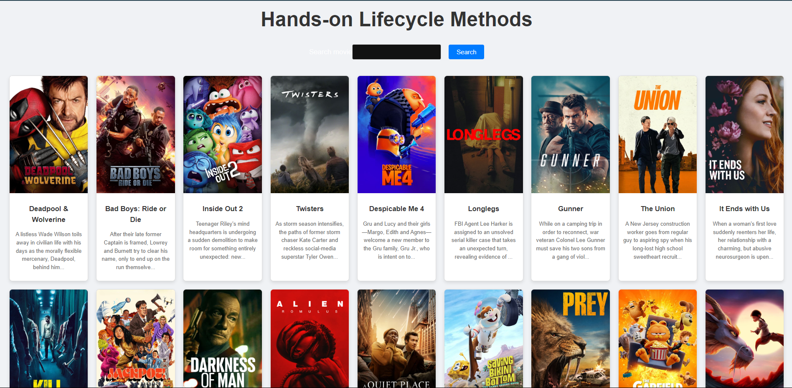

# Movie Search App

A React-based movie search application that allows users to search for movies using the [TMDb API](https://www.themoviedb.org/). The application displays a list of popular movies by default and lets users search for specific movies by title. The app includes an error boundary to handle unexpected errors gracefully and features a responsive design.

## Features

- **Search Movies**: Search for movies by title using the search bar.
- **Popular Movies**: Displays a list of popular movies fetched from the TMDb API.
- **Error Handling**: An error boundary catches and displays errors without crashing the app.
- **Responsive Design**: The app is designed to be responsive and user-friendly across various devices.

## Screenshots



## Technologies Used

- **React**: A JavaScript library for building user interfaces.
- **Axios**: A promise-based HTTP client for making API requests.
- **TMDb API**: The Movie Database API for fetching movie data.
- **CSS**: Custom CSS for styling the app components.

## Getting Started

These instructions will help you set up and run the project locally.

### Prerequisites

- **Node.js**: Ensure you have Node.js installed. You can download it from [here](https://nodejs.org/).
- **npm**: npm is installed with Node.js. You can verify its installation by running `npm -v` in your terminal.

### Installation

1. **Clone the repository:**

   ```bash
   git clone https://github.com/RizqiRahcman/ReactContext_Digistar2024.git
   cd ReactContext_Digistar2024
   ```

2. **Install the dependencies:**

   ```bash
   npm install
   ```

3. **Run the application:**

   ```bash
   npm start
   ```

4. **Open your browser and visit:**

   ```
   http://localhost:3000
   ```

## Project Structure

- **App.js**: The main component that includes the search bar and displays the ListMovie component.
- **ListMovie.js**: A functional component that fetches and displays movie data from the TMDb API based on user search input.
- **ErrorBoundary.js**: A class component that catches JavaScript errors anywhere in the child component tree and displays a fallback UI.
- **App.css**: Contains styles for the application.

## Usage

- Viewing Popular Movies: Upon loading the app, you will see a list of popular movies fetched from the TMDb API.
- Searching for Movies: Enter a movie title in the search bar and click the "Search" button to find movies matching the entered title.
- Error Handling: If there is an error fetching data from the API, an error message will be displayed.

## Built With

- **React**: For building the user interface.
- **Axios**: For making HTTP requests to the TMDb API.
- **TMDb API**: For retrieving movie data.
- **CSS**: For custom styling and responsive design.

## Contributing

Feel free to contribute to this project by submitting issues or pull requests. Please follow the established code style and conventions.

## License

This project is licensed under the MIT License - see the [LICENSE](LICENSE) file for details.

## Acknowledgments

- Special thanks to TMDb for providing the movie data API.
